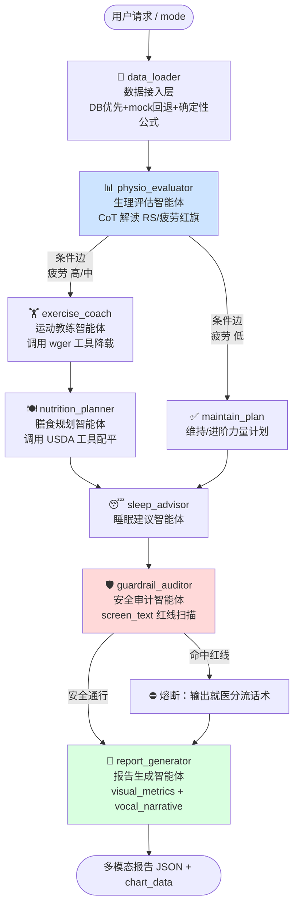

# HPU 健身训练助手 - 系统设计文档

> Health Personal Unit | 健身 × 饮食 × 睡眠 综合管理系统

## 🏗️ 系统架构

### 整体架构
```
┌─────────────────┐    ┌─────────────────┐    ┌─────────────────┐
│   Vue3          │    │   FastAPI       │    │   LangGraph     │
│   前端界面      │◄──►│   后端API       │◄──►│   多智能体系统  │
│                 │    │                 │    │                 │
└─────────────────┘    └─────────────────┘    └─────────────────┘
```

### 技术栈
- **前端**: Streamlit (Python Web框架)
- **后端**: FastAPI (高性能异步API框架)
- **AI引擎**: LangGraph (多智能体协作框架)
- **大语言模型**: ChatOpenAI（OpenAI 兼容接口，可接入 DeepSeek、通义千问等
- **部署**: Docker容器化 + 可选的Kubernetes


## 🤖 AI智能体团队

### 核心智能体
1. **🧹 data_loader（数据接入层）** — DB 优先 + mock 回退 + 确定性公式
2. **📊 physio_evaluator（生理评估智能体）** — CoT 解读 RS / 疲劳红旗
3. **🏋️ exercise_coach（运动教练智能体）** — 调用 wger 工具降载（疲劳高/中时触发）
4. **✅ maintain_plan（维持/进阶力量计划）** — 疲劳低时维持或进阶力量计划
5. **🍽️ nutrition_planner（膳食规划智能体）** — 调用 USDA 工具配平
6. **😴 sleep_advisor（睡眠建议智能体）** — 睡眠恢复与作息建议
7. **🛡️ guardrail_auditor（安全审计智能体）** — screen_text 红线扫描，命中则熔断就医分流
8. **📑 report_generator（报告生成智能体）** — visual_metrics + vocal_narrative 多模态报告

### 智能体协作流程

#### 简化流程
```
用户请求 → data_loader → physio_evaluator → [疲劳高/中: exercise_coach | 疲劳低: maintain_plan]
         → nutrition_planner → sleep_advisor → guardrail_auditor → report_generator → 多模态报告
```

#### 详细工作流程图



## 🚀 快速开始
### 环境要求
- Python 3.12+
- Node.js 18+
- 8GB+ RAM (推荐16GB)
- 稳定的网络连接

### 1. 进入项目目录
```bash
cd physio-artisan-hpu5800
```

### 2. 安装依赖
```bash
# 安装后端依赖
pip install -r backend/requirements.txt

# 安装前端依赖
cd frontend && npm install
```

### 3. 配置环境变量
```bash
# 创建环境变量文件
cd backend
cp env.example .env

# 编辑环境变量
vim .env
```

必需的环境变量：
```bash
OPENAI_API_KEY=your_openai_style_api_key
OPENAI_BASE_URL=https://api.deepseek.com/v1  # 可按需调整
OPENAI_MODEL=deepseek-chat                  # 可按需调整
```

可选服务（用于MCP天气服务器）：
```bash
QWEATHER_API_KEY=your_qweather_api_key
QWEATHER_API_BASE=https://api.qweather.com
```

### 4. 启动服务

#### 方法1: 使用启动脚本
```bash
# 启动脚本添加执行权限
chmod 777 start_*.sh
# 启动后端服务
./start_backend.sh

# 启动前端服务
./start_frontend.sh
```

#### 方法2: 手动启动
```bash
# 启动后端
cd backend
python api_server.py

# 启动前端 (新终端)
cd frontend
streamlit run streamlit_app.py
```


### 5. 访问应用
- **前端界面**: http://localhost:8501
- **后端API**: http://localhost:8080
- **API文档**: http://localhost:8080/docs
- **健康检查**: http://localhost:8080/health

## 📋 使用说明

## 🔧 故障排除

### 常见问题

#### 1. 请求超时问题
**症状**: 前端显示"任务执行中..."
**原因**: 网络延迟或后端处理时间较长
**解决方案**: 
- 等待几分钟后刷新页面
- 使用手动查询功能
- 检查网络连接

#### 2. 后端连接失败
**症状**: "后端服务连接失败"
**解决方案**:
```bash
# 检查后端服务状态
curl http://localhost:8080/health

# 重启后端服务
./start_backend.sh
```

#### 3. API密钥错误
**症状**: "API认证失败"
**解决方案**:
- 检查环境变量设置
- 验证API密钥有效性
- 确认API配额充足

### 性能优化建议

1. **增加超时时间**: 对于复杂规划任务，适当增加前端超时设置
2. **并发处理**: 后端支持多任务并发处理
3. **缓存机制**: 利用内存缓存减少重复计算
4. **异步处理**: 使用异步API提高响应速度

## 📊 系统监控

### 日志文件
- **后端日志**: `backend/logs/backend.log`
- **前端日志**: `logs/frontend.log`
- **错误日志**: `logs/error.log`

### 健康检查
```bash
# 检查服务状态
curl http://localhost:8080/health

# 查看任务状态
curl http://localhost:8080/status/{task_id}
```

## 🚀 部署选项

### Docker部署（推荐使用 Compose）
```bash
# 使用 Docker Compose 启动（自动构建前后端镜像）
docker compose up --build

# 后台启动
docker compose up -d --build
```

## 📋 使用说明

## 🔧 故障排除

### 常见问题

#### 1. 请求超时问题
**症状**: 前端显示"任务执行中..."
**原因**: 网络延迟或后端处理时间较长
**解决方案**: 
- 等待几分钟后刷新页面
- 使用手动查询功能
- 检查网络连接

#### 2. 后端连接失败
**症状**: "后端服务连接失败"
**解决方案**:
```bash
# 检查后端服务状态
curl http://localhost:8080/health

# 重启后端服务
./start_backend.sh
```

#### 3. API密钥错误
**症状**: "API认证失败"
**解决方案**:
- 检查环境变量设置
- 验证API密钥有效性
- 确认API配额充足

### 性能优化建议

1. **增加超时时间**: 对于复杂规划任务，适当增加前端超时设置
2. **并发处理**: 后端支持多任务并发处理
3. **缓存机制**: 利用内存缓存减少重复计算
4. **异步处理**: 使用异步API提高响应速度

## 📊 系统监控

### 日志文件
- **后端日志**: `backend/logs/backend.log`
- **前端日志**: `logs/frontend.log`
- **错误日志**: `logs/error.log`

### 健康检查
```bash
# 检查服务状态
curl http://localhost:8080/health

# 查看任务状态
curl http://localhost:8080/status/{task_id}
```

## 🚀 部署选项

### Docker部署（推荐使用 Compose）
```bash
# 使用 Docker Compose 启动（自动构建前后端镜像）
docker compose up --build

# 后台启动
docker compose up -d --build
```


## 📄 许可证

MIT License - 详见 [LICENSE](LICENSE) 文件

## 🙏 致谢

- OpenAI / ChatOpenAI 团队及各大 OpenAI 兼容模型服务商
- DuckDuckGo提供的实时搜索服务
- LangGraph团队的多智能体框架
- Streamlit和FastAPI的优秀框架支持

---

**注意**: 本系统需要稳定的网络连接和有效的API密钥才能正常工作。首次使用请确保完成所有配置步骤。