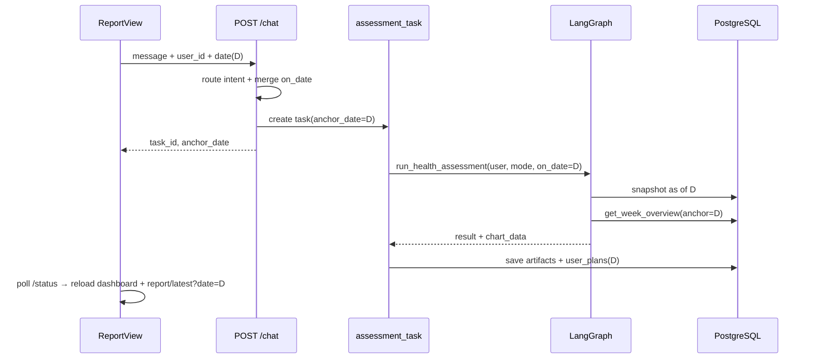

## Context

### 现状（as-is）

```
报告页选 date ──► GET /dashboard/{uid}?date=     ✅ 已支持
用户说「生成报告」─► POST /chat                   ❌ 无 date/user_id
                      └─► get_health_snapshot()   永远最新一行 watch_data
                      └─► build_report_payload()  get_week_overview(uid) 无 date
                      └─► save_user_plan(today)   计划写入今天
前端 ChatDock       postChat({ message })         无上下文
```

| 组件 | 问题 |
|------|------|
| `ChatRequest` | 仅有 `message/conversation_id/image_base64/mode` |
| `/chat` report 分支 | `user_id=intake.DEFAULT_USER_ID`（恒为 1） |
| `get_health_snapshot` | `watch_data … ORDER BY date DESC LIMIT 1` |
| `exercise_records` / `nutrition_logs` 快照 | 同上，最新一条 |
| `build_report_payload` | dashboard 未传 `on_date` |
| `run_assessment_task` | `save_user_plan(user_id, date.today(), …)` |
| `/report/latest` | 仅「最近一次」，无法对齐历史日 |
| 前端 `chat.ts` | 未接 `useUserStore` / `useReportStore.date` |

### 目标（to-be）

用户在报告页选中 **D 日**，通过 Chat（或 `/plan`）触发报告时，多智能体读取 **截至 D 日（含）** 的穿戴/运动/饮食快照，产出与 `GET /dashboard?date=D` 一致的 dashboard 嵌入 `chart_data`，并将 AI 计划写入 `user_plans.plan_date = D`。

---

## Goals / Non-Goals

**Goals**

1. `/chat`、`/plan` 支持 `user_id` + `date`（锚点日），默认与 nutrition/dashboard 一致（今天、user=1）
2. 数据接入层按锚点日取数，与 `get_week_overview(user_id, on_date=date)` 语义对齐
3. 报告缓存与读取可关联 `anchor_date`；前端健康建议仅在日期匹配时展示
4. 自然语言可补充日期（路由 LLM 抽取），显式参数优先

**Non-Goals**

- 不为每个历史日自动跑批生成报告
- 不重构 `control|experiment` 场景体系（保留字段，seed v31 演示以 DB 真实日期弧为主）
- 不改变 Chat 数据录入的日期逻辑（录入仍默认今天，另开变更）

---

## Decisions

### D1：锚点日字段命名与传递

| 层 | 字段名 | 说明 |
|----|--------|------|
| HTTP Query/Body | `date` | 与 `/dashboard`、`/nutrition` 一致，`YYYY-MM-DD` |
| Python 内部 | `on_date` | 与 `get_nutrition_overview`、`save_sleep_entry` 一致 |
| 任务元数据 / 响应 | `anchor_date` | 回显给用户与前端状态机 |

`POST /chat` 请求扩展：

```jsonc
{
  "message": "帮我生成健康体检报告",
  "conversation_id": null,
  "user_id": 1,           // 新增，默认 1
  "date": "2026-06-15",   // 新增，可选，默认今天
  "mode": "control"       // 保留
}
```

`ChatResponse` 在 `intent=report` 时增加 `anchor_date`（与 `task_id` 同返）。

### D2：日期解析优先级

```
1. 请求体 date（前端报告页当前选中）
2. 意图路由 extracted.on_date（LLM 从话术解析）
3. 默认 date.today()
```

校验：

- 格式 `YYYY-MM-DD`，非法 → 422
- `date > today` → 422，reply 提示「不能生成未来日期报告」
- `date < today - 365`（可配置常量）→ 可选软警告，仍允许（演示 seed 仅 14 天）

路由 prompt 增补字段：

```json
"on_date": "YYYY-MM-DD | null",
"reply": "…"
```

示例话术：「生成上周一的报告」→ 解析为具体日期或追问澄清。

### D3：数据层按锚点日取数（核心）

**`get_health_snapshot(user_id, mode=None, on_date=None)`**

| 数据 | 查询策略 |
|------|----------|
| `watch_data` | `WHERE user_id=%s AND date <= %s ORDER BY date DESC LIMIT 1`（锚点日及以前最近一条） |
| `exercise_records` | 同上，`date <= on_date` |
| `nutrition_logs` | `WHERE user_id=%s AND date = %s`（锚点日当天） |
| `_compute_baselines` | 仅用 `date < on_date` 的历史行算 HRV/RHR 基线 |

无行时维持现有 mock 回退，`sources` 标注不变。

**`build_report_payload(user_id, result, on_date=None)`**

```python
dashboard = hdata.get_week_overview(user_id, on_date=on_date)
```

保证 LLM 报告内嵌 dashboard 与看板 API 一致。

**`run_health_assessment`**

state 增加 `on_date`；`DataLoader` 节点调用 `get_health_snapshot(user_id, mode, on_date)`。

### D4：计划回写与缓存

**`save_user_plan(user_id, plan_date, result)`**

- `plan_date = on_date`（非 `today()`）
- 与 `agent-plan-writeback` 幂等键 `(user_id, plan_date)` 对齐：历史日报告写历史日计划，不覆盖今天 seed

**`ai_conversations.recommendations` JSON**

增加元数据：

```jsonc
{
  "mode": "control",
  "anchor_date": "2026-06-15",
  "fatigue_level": "medium",
  "final_report": { "chart_data": { … } }
}
```

**`GET /report/latest/{user_id}?date=`**

- 无 `date`：行为不变（最近一条）
- 有 `date`：`WHERE recommendations->>'anchor_date' = %s`（或 `created_at` 窗口 + 元数据）取匹配报告
- 无匹配：404，前端仅展示 dashboard 看板，健康建议区显示「该日暂无 AI 报告，可在聊天中生成」

> 若 JSON 查询成本高，首期可在 `assessment_tasks` 内存结构带 `anchor_date`，`/status` 结果亦带回；落库字段二期可加列 `anchor_date DATE`（本设计推荐 **首期只写 JSON 元数据**，避免 DDL）。

### D5：前端报告页与 Chat 联动

```
ReportView
  ├─ reportStore.date  ◄──►  Header 日期切换
  └─ ChatDock
        postChat({
          message,
          conversation_id,
          user_id: userStore.userId,
          date: reportStore.date,   // 与看板同步
        })
```

`chat` store：

- `send(text, opts?: { userId?, date? })` 或由调用方传入（报告页 wrapper）
- 收到 `intent=report` + `task_id` → 轮询 `/status/{task_id}`（若前端尚未实现轮询，本期在报告页补最小轮询）

`report` store：

- `healthAdvice` getter：仅当 `result.recommendations.anchor_date === date` 时返回三卡文案，否则 `null`
- 轮询完成后 `load()` 刷新 dashboard + `getLatestReport(uid, date)`

### D6：`/chat` 同步修复 `user_id`

报告与数据录入分支统一使用 `request.user_id`（默认 1），与 Header 演示用户切换一致；安全日志 `save_safety_log` 同步传 `request.user_id`。

### D7：与 `mode` 的关系

- `mode` 仍传入 `run_health_assessment`，用于 mock 补齐缺失字段时的场景选择
- seed v31 已写入真实日期序列时，**以 DB 为准**；`mode` 仅影响缺失项回退，不改变锚点日
- 文档注明：答辩演示推荐 `mode=control` + user=1/2 对比，日期由 Header 切换

---

## API 变更摘要

### POST `/chat`

| 字段 | 变更 |
|------|------|
| `user_id` | 新增，int，默认 1 |
| `date` | 新增，可选，`YYYY-MM-DD` |
| 响应 `anchor_date` | 新增，`intent=report` 时返回 |

### POST `/plan`

| 字段 | 变更 |
|------|------|
| `date` | 新增，可选，语义同 chat |

### GET `/report/latest/{user_id}`

| Query | 说明 |
|-------|------|
| `date` | 可选，按 `anchor_date` 筛选 |

### GET `/status/{task_id}`

`result` 或任务元数据含 `anchor_date`（便于前端校验）。

---

## 数据流（to-be）



---

## Risks / Trade-offs

| 风险 | 缓解 |
|------|------|
| 历史日无足够 DB 行，报告质量差 | mock 回退 + reply 提示「该日数据不完整」 |
| LLM 日期解析错误 | 显式参数优先；解析失败默认今天；可追问 |
| `/report/latest` JSON 筛选慢 | 演示数据量小可接受；后续加 `anchor_date` 列索引 |
| 健康建议与日看板短暂不一致 | getter 按 `anchor_date === date` 门控 |
| 改动面跨 API/数据/编排/前端 | 分阶段实施（见 tasks.md） |

---

## Migration Plan

1. **后端数据层**：`get_health_snapshot` / `build_report_payload` 支持 `on_date`（可单测）
2. **API**：扩展 chat/plan/report.latest；贯通 task 链路
3. **前端**：chat 传参 + report 健康建议门控 + 可选轮询
4. **文档**：`docs/接口契约.md`
5. **回归**：seed v31 后，选 14 天内任意日 → dashboard 与 chat 报告 dashboard 字段一致

无破坏性 DDL（首期）；旧缓存无 `anchor_date` 时 `/report/latest?date=` 返回 404，无 date 查询仍可用。

---

## Open Questions（实施前可确认）

1. **Chat 轮询**：报告页 ChatDock 本期是否要实现 `/status` 自动轮询并 toast 完成？（建议：是，否则用户不知道报告已好）
2. **历史日重复生成**：同一 `(user_id, date)` 再次 chat 报告是否覆盖 `user_plans`？（建议：是，与 agent-plan-writeback 幂等一致）
3. **`mode` 默认值**：是否改为从用户画像/剧情推断？（建议：本期保持 `control` 默认）
