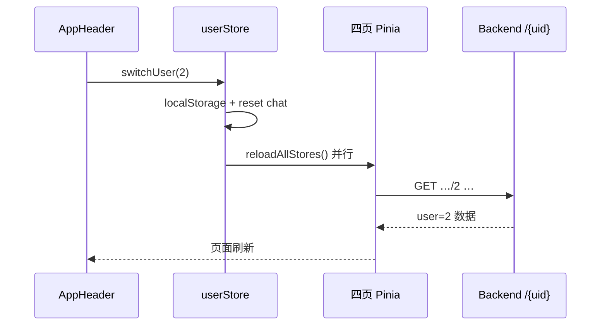

## Context

### 数据侧（已有）

`backend/scripts/seed_week_history_v31.py` 为两名用户写入最近 14 天完整历史：

| user_id | 名称 | 剧情 |
|---------|------|------|
| 1 | 小明 | improving 向好周 |
| 2 | 小强 | degrading 恶化周 |

后端只读 API 均以路径参数区分用户：

```
GET /dashboard/{user_id}?date=
GET /sleep/{user_id}
GET /exercise/{user_id}
GET /nutrition/{user_id}?date=
GET /report/latest/{user_id}?date=
```

### 前端侧（改造前）

每个 store 独立 `export const USER_ID = 1`；`AppHeader` 写死 `Hello Kevin`。

---

## Goals / Non-Goals

**Goals**

1. 单一真相源 `useUserStore().userId`，默认 1
2. Header 一键切换，四页数据同步刷新
3. 切换后 chat 会话不串用户
4. 刷新浏览器仍保持选中用户

**Non-Goals**

- 账号体系、JWT、多租户
- SideNav / 路由级用户参数（`?uid=`）
- 后端强制校验 Header 用户与 token 一致

---

## Decisions

### D1：Pinia `user` store 作为全局 userId

```ts
DEMO_USERS = [{ id: 1, name: '小明' }, { id: 2, name: '小强' }]
state: { userId, reloadVersion, reloading }
switchUser(id) → 写 localStorage → reset chat → reloadAllStores()
```

各业务 store 的 `load(userId?)` 默认：

```ts
const uid = userId ?? useUserStore().userId
```

移除各文件 `USER_ID = 1` 常量，避免漂移。

### D2：AppHeader 头像 = 用户切换入口

- ant-design-vue `a-dropdown` + `a-menu`
- 当前用户项 disabled 并标注「（当前）」
- `reloading` 时头像按钮 disabled + pulse 动画

问候语：`Hello {{ userName }}`，与 DB seed 名称对齐（不再用 Kevin）。

### D3：切换后并行刷新四页 store

`reloadAllStores()` 动态 import 四个 store，避免与 `user.ts` 循环依赖：

```ts
await Promise.all([
  useReportStore().load(),
  useExerciseStore().load(),
  useSleepStore().load(),
  useNutritionStore().load(),
])
```

各 store `load()` 开头清空 `data`/`dashboard`，避免短暂显示上一用户数据。

**保留上下文**：report/nutrition 的 `date` 筛选在切换后不变（仍查新用户同一天）。

### D4：Chat 会话隔离

切换用户时 `useChatStore().reset()` 清空 `conversationId` 与最后一轮问答，避免会话 ID 与旧用户报告混在一起。

报告页 Chat 额外传 `user_id: userStore.userId`（见 `add-chat-report-by-date`）。

### D5：localStorage 持久化

Key: `hpu-demo-user-id`，值 `1` | `2`；非法值回退 1。

### D6：与后端默认用户的对齐

后端 `/chat`、数据录入等仍默认 `user_id=1`，前端切换用户后必须通过请求体显式传 `user_id`，否则报告/录入仍落在 user=1（已在 `add-chat-report-by-date` 中修复 chat/plan）。

---

## 数据流



---

## Risks / Trade-offs

| 风险 | 缓解 |
|------|------|
| 切换时四 API 并行，弱网略慢 | 头像 loading 禁用重复点击 |
| user=2 无 LLM 报告缓存 | 健康建议区占位提示，可 chat 生成 |
| 非报告页 Chat 仍可能缺 user_id | 本期仅报告页 Chat 传参；其余页 Chat 为录入/引导 |

---

## Migration

纯前端增量；无后端迁移。首次部署后默认 user=1，与历史行为一致。
