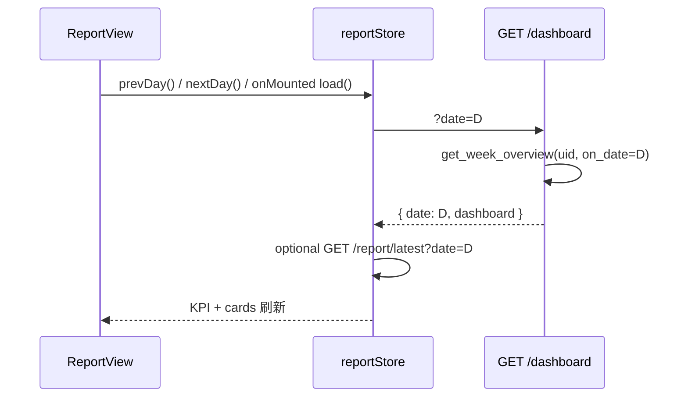

## Context

### 改造前

```
ReportView Header: 硬编码 "2026-06-01"
GET /dashboard/{uid}     → get_week_overview(uid)  // 永远最新一行
report store load()      → 优先 /report/latest 内嵌 dashboard（易 stale）
```

### 改造后

```
ReportView: store.date + prevDay/nextDay
GET /dashboard/{uid}?date=D  → get_week_overview(uid, on_date=D)
响应 { user_id, date: D, dashboard: { kpi, body_overview, … } }
```

---

## Goals / Non-Goals

**Goals**

1. 与饮食页一致的 `?date=` 查询语义
2. Header 显示与数据一致的锚点日
3. seed 14 天内可前后浏览，看见 KPI/睡眠/运动随日变化
4. 看板数据始终来自 DB 实时聚合，不绑死 LLM 缓存日期

**Non-Goals**

- DatePicker 任意选日
- 持久化用户选中的报告日期到 localStorage（刷新回今天）
- 改动 LangGraph 工作流（见 `add-chat-report-by-date`）

---

## Decisions

### D1：锚点日语义（与 nutrition 对齐）

| 概念 | 规则 |
|------|------|
| 锚点日 D | Query `date`，缺省 `today()` |
| 当日面板 | `watch_data` 中 `date = D` 的行（无则空） |
| 本周 | `[D-6, D]` |
| 上周 | `[D-13, D-7]` |
| 营养 | `nutrition_logs.date = D` |
| `body_overview.update_date` | 回显 `D.isoformat()` |

查询窗口：`[D-13, D]` 共 14 天（`window = max(days, 14)`）。

### D2：API 响应形状

```json
{
  "user_id": 1,
  "date": "2026-06-15",
  "dashboard": { "kpi": {}, "body_overview": {}, … }
}
```

Query 参数名 `date`（FastAPI 内部 `on_date`，与 nutrition/dashboard 文档一致）。

### D3：前端 report store

```ts
state: { date, dashboard, result, hasReport, loading }
load(date?) → getDashboard(uid, date) → this.date = r.date
prevDay() / nextDay()  // next 不超过 todayLocal()
```

`load` 开始时清空 `dashboard`，避免切换日短暂串显。

**取数优先级**（load 内）：

1. `GET /dashboard/{uid}?date=` → 绑定 KPI/身体/睡眠/饮食/运动/周对比
2. `GET /report/latest/{uid}?date=` → 仅 healthAdvice（404 则占位提示）

### D4：ReportView Header 中间槽

```
[ {date}健康数据 ]  [ ‹  📅 YYYY-MM-DD  › ]  [ 导出报告 ]
```

- `reportDatePill` / `reportDateDisplay` 来自 `store.date`
- `loading` 时禁用 ‹ ›
- `isToday` 时禁用 ›

### D5：健康建议门控

```ts
healthAdvice: 仅当 hasReport && result.anchor_date === date
```

避免选中历史日 D 却展示另一天 LLM 报告的三卡文案。

### D6：与 `/report/latest` 缓存解耦

早期实现曾优先用缓存报告内嵌 dashboard，导致 seed 后仍显示旧日期。现 **dashboard 只走 `/dashboard?date=`**，与 Chat 生成后 `chart_data.dashboard` 对齐（`add-chat-report-by-date` 保证同函数 `get_week_overview`）。

---

## 数据流



---

## Risks / Trade-offs

| 风险 | 缓解 |
|------|------|
| 锚点日无 watch 行，面板大量 `—` | 正常；seed 覆盖最近 14 天 |
| 周对比在窗口边缘样本少 | 接受；演示数据连续 14 天 |
| 与 Chat 报告日期需手动对齐 | 同一 `store.date`；Chat 传 `date` 参数 |

---

## Migration

无 DDL。旧前端硬编码日期移除；后端 `on_date` 缺省行为与改造前「今天」一致。
